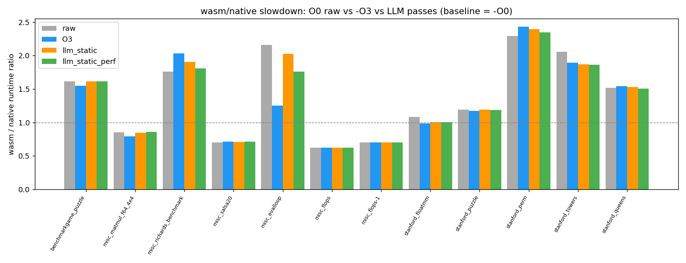
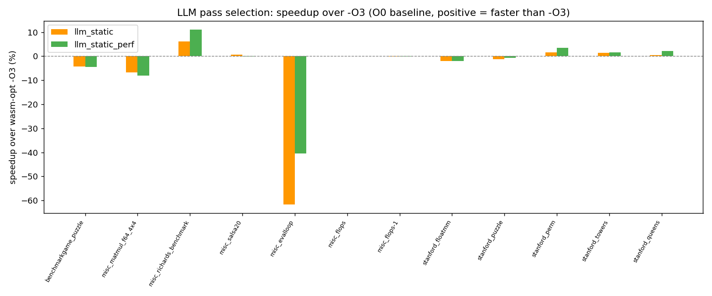
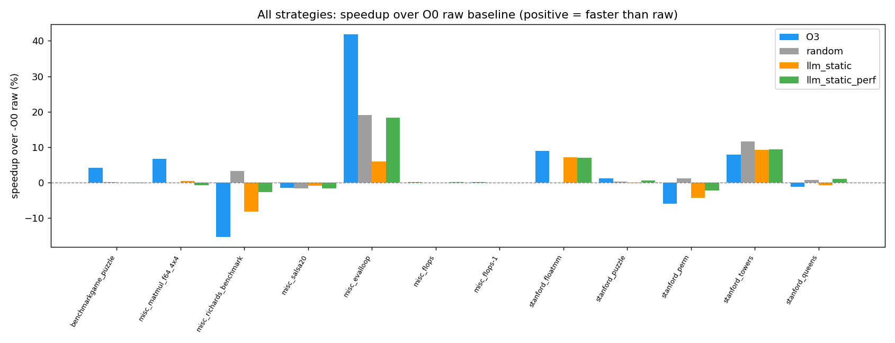

# PoC 结果：LLM 引导的 wasm-opt pass 选择（O0 baseline，wasmer/cranelift）

- 评估程序数：**12**
- 策略结果行数：**60** | 通过验证：**59** | 差分正确：**54**
- 被接受的候选数（正确 + 相比 O0 raw 至少快 3%）：**14**

## RQ1：wasm-opt -O3 相比 O0 raw 能提升多少？

- wasm-opt -O3 相比 O0 raw 的平均加速：**3.9%** （ratio 平均下降 0.078，在 7/11 个程序上改善）

## RQ2：LLM 能否超过 wasm-opt -O3？

- **random**：在 **4/12** 个程序上快于 -O3；获胜程序上的平均 speedup over -O3 = **7.2%**
  - 获胜程序：misc_richards_benchmark, stanford_perm, stanford_towers, stanford_queens
- **llm_static**：在 **5/12** 个程序上快于 -O3；获胜程序上的平均 speedup over -O3 = **2.1%**
  - 获胜程序：misc_richards_benchmark, misc_salsa20, stanford_perm, stanford_towers, stanford_queens
- **llm_static_perf**：在 **4/12** 个程序上快于 -O3；获胜程序上的平均 speedup over -O3 = **4.6%**
  - 获胜程序：misc_richards_benchmark, stanford_perm, stanford_towers, stanford_queens

## RQ3：LLM 优化是否降低 wasm/native ratio？

- **O3**：相对 O0 raw 的平均 ratio 下降 = **0.078** （在 7/11 个程序上改善）
- **llm_static**：相对 O0 raw 的平均 ratio 下降 = **0.012** （在 5/11 个程序上改善）
- **llm_static_perf**：相对 O0 raw 的平均 ratio 下降 = **0.051** （在 6/11 个程序上改善）

## RQ4：static-only 与 static+perf 的消融对比

- static-only LLM 在 5 个程序上超过 -O3（获胜程序平均 +2.1%）。
- static+perf LLM 在 4 个程序上超过 -O3（获胜程序平均 +4.6%）。

## 单程序结果明细

| 程序 | 类型 | raw(O0) ratio | O3 ratio | llm_static ratio | llm_static_perf ratio | best vs O3 | passes（static_perf） |
|---|---|---|---|---|---|---|---|
| benchmarkgame_puzzle | control_flow | 1.6132 | 1.5475 | 1.6139 | 1.6154 | -4.3% | `--remove-unused-brs --merge-blocks --optimize-instructions --simplify-locals --coalesce-locals` |
| misc_matmul_f64_4x4 | loop_compute | 0.851 | 0.7938 | 0.8481 | 0.8581 | -6.8% | `--simplify-locals --coalesce-locals --precompute --optimize-instructions --vacuum` |
| misc_richards_benchmark | call_dense | 1.7608 | 2.032 | 1.9061 | 1.8078 | 11.0% | `--inlining-optimizing --simplify-locals --coalesce-locals --dce --vacuum` |
| misc_salsa20 | loop_compute | 0.7017 | 0.7124 | 0.7081 | 0.7132 | 0.6% | `--simplify-locals --coalesce-locals --optimize-instructions --precompute --vacuum` |
| misc_evalloop | control_flow | 2.1567 | 1.2544 | 2.0278 | 1.7623 | -40.5% | `--inlining-optimizing --remove-unused-brs --merge-blocks --simplify-locals --optimize-instructions` |
| misc_flops | loop_compute | 0.6248 | 0.6238 | 0.6247 | 0.6244 | - | `--simplify-locals --coalesce-locals --precompute --optimize-instructions --vacuum` |
| misc_flops-1 | loop_compute | 0.6994 | 0.6991 | 0.6993 | 0.6993 | -0.0% | `--remove-unused-brs --merge-blocks --optimize-instructions --simplify-locals --vacuum` |
| stanford_floatmm | loop_compute | 1.08 | 0.9841 | 1.0035 | 1.0048 | -2.0% | `--inlining-optimizing --remove-unused-brs --simplify-locals --optimize-instructions --vacuum` |
| stanford_puzzle | control_flow | 1.1896 | 1.176 | 1.1916 | 1.1831 | -0.6% | `--inlining-optimizing --dce --simplify-locals --optimize-instructions --vacuum` |
| stanford_perm | call_dense | 2.2922 | 2.4303 | 2.3938 | 2.3441 | 3.5% | `--inlining-optimizing --simplify-locals --coalesce-locals --dce --vacuum` |
| stanford_towers | call_dense | 2.0556 | 1.8949 | 1.8667 | 1.8633 | 1.7% | `--inlining-optimizing --simplify-locals --coalesce-locals --dce --optimize-instructions` |
| stanford_queens | control_flow | 1.5207 | 1.5391 | 1.5318 | 1.5066 | 2.1% | `--remove-unused-brs --merge-blocks --inlining-optimizing --simplify-locals --optimize-instructions` |

## 运行检查与异常说明

- 本次运行与“改用 O0 后会暴露更多 pass 选择差异”的预期基本一致：LLM 方案在部分程序上超过 -O3，尤其是 `misc_richards_benchmark`、`stanford_perm`、`stanford_towers`、`stanford_queens`。
- 但 `wasm-opt -O3` 相比 O0 raw 的平均加速只有 3.9%，低于最初预期的“大幅提升”。主要原因是 wasmer/cranelift AOT 会在运行前再次优化 wasm，而 native baseline 仍是 `-O0`，所以 `misc_salsa20`、`misc_flops`、`misc_flops-1` 等程序的 raw wasm/native ratio 反而小于 1。
- `misc_flops` 的 raw、O3、random、LLM 全部差分失败，不是某个 pass 破坏语义；该 benchmark 会输出 RunTime/MFLOPS 和浮点 signed-zero，native 与 wasm 的文本输出本身存在细微差异。
- `stanford_floatmm` 的 random 策略构建失败，Binaryen 报错为 “IR must be flat: run --flatten beforehand”；这是随机 pass 序列组合不稳定导致的无效候选，LLM 两个策略均可正常构建并通过验证。

## 图表

