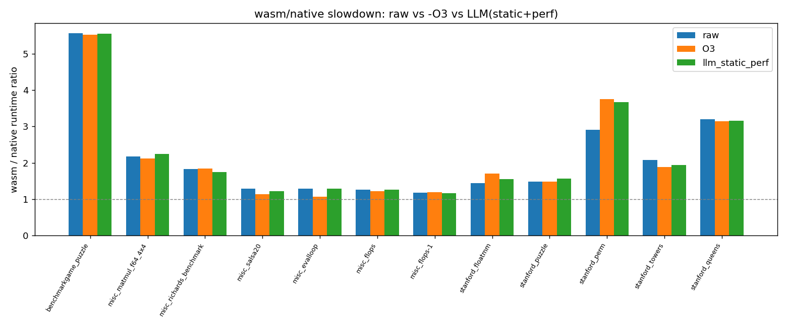
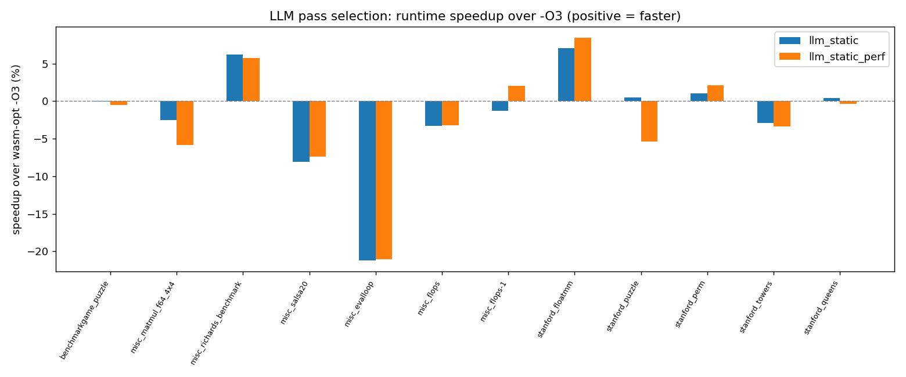

# PoC 结果：LLM 引导的 `wasm-opt` pass 选择（wasmer/cranelift）

- 评估程序数：**12**
- 策略结果行数：**72** | 通过验证：**70** | 差分正确：**70**
- 被接受的候选数（正确 + 相比 raw 至少快 3%）：**18**

## RQ2：LLM 能否超过 wasm-opt -O3？

- **random**：在 **1/12** 个程序上快于 -O3；获胜程序上的平均 speedup over -O3 = **1.6%**
  - 获胜程序：stanford_perm
- **llm_static**：在 **5/12** 个程序上快于 -O3；获胜程序上的平均 speedup over -O3 = **3.0%**
  - 获胜程序：misc_richards_benchmark, stanford_floatmm, stanford_puzzle, stanford_perm, stanford_queens
- **llm_static_perf**：在 **4/12** 个程序上快于 -O3；获胜程序上的平均 speedup over -O3 = **4.6%**
  - 获胜程序：misc_richards_benchmark, misc_flops-1, stanford_floatmm, stanford_perm

## RQ3：LLM 优化是否降低 wasm/native ratio？

- **O3**：相对 raw 的平均 ratio 变化 = **-0.031**（在 8/12 个程序上改善）
- **llm_static**：相对 raw 的平均 ratio 变化 = **-0.047**（在 7/12 个程序上改善）
- **llm_static_perf**：相对 raw 的平均 ratio 变化 = **-0.056**（在 7/12 个程序上改善）

## RQ4：static-only 与 static+perf 的消融对比

- static-only LLM 在 5 个程序上超过 -O3（获胜程序平均 +3.0%）。
- static+perf LLM 在 4 个程序上超过 -O3（获胜程序平均 +4.6%）。

## 单程序结果明细

| 程序 | 类型 | raw ratio | O3 ratio | llm_static ratio | llm_static_perf ratio | best vs O3 | passes（static_perf） |
|---|---|---|---|---|---|---|---|
| benchmarkgame_puzzle | control_flow | 5.5623 | 5.5216 | 5.5262 | 5.5499 | -0.1% | `--remove-unused-brs --merge-blocks --optimize-instructions --simplify-locals --vacuum` |
| misc_matmul_f64_4x4 | loop_compute | 2.1708 | 2.1199 | 2.174 | 2.2437 | -2.5% | `--inlining-optimizing --optimize-instructions --local-cse --simplify-locals --vacuum` |
| misc_richards_benchmark | call_dense | 1.8285 | 1.8458 | 1.7314 | 1.7392 | 6.2% | `--inlining-optimizing --optimize-instructions --simplify-locals --dce --vacuum` |
| misc_salsa20 | loop_compute | 1.2826 | 1.1353 | 1.2269 | 1.2195 | -7.4% | `--optimize-instructions --local-cse --simplify-locals --coalesce-locals --vacuum` |
| misc_evalloop | control_flow | 1.2808 | 1.0633 | 1.2887 | 1.287 | -21.0% | `--remove-unused-brs --merge-blocks --optimize-instructions --simplify-locals --coalesce-locals` |
| misc_flops | loop_compute | 1.2635 | 1.2216 | 1.2618 | 1.2613 | -3.2% | `--optimize-instructions --local-cse --simplify-locals --precompute --vacuum` |
| misc_flops-1 | loop_compute | 1.1771 | 1.1911 | 1.2066 | 1.1665 | 2.1% | `--inlining-optimizing --dce --optimize-instructions --simplify-locals --vacuum` |
| stanford_floatmm | loop_compute | 1.4441 | 1.6972 | 1.578 | 1.554 | 8.4% | `--remove-unused-brs --merge-blocks --optimize-instructions --simplify-locals --vacuum` |
| stanford_puzzle | control_flow | 1.4842 | 1.4831 | 1.4754 | 1.5629 | 0.5% | `--inlining-optimizing --dce --optimize-instructions --simplify-locals --vacuum` |
| stanford_perm | call_dense | 2.9108 | 3.7457 | 3.7063 | 3.6678 | 2.1% | `--inlining-optimizing --optimize-instructions --simplify-locals --dce --vacuum` |
| stanford_towers | call_dense | 2.0721 | 1.878 | 1.933 | 1.9413 | -2.9% | `--inlining-optimizing --dce --optimize-instructions --simplify-locals --vacuum` |
| stanford_queens | control_flow | 3.1988 | 3.147 | 3.1342 | 3.1581 | 0.4% | `--remove-unused-brs --merge-blocks --optimize-instructions --simplify-locals --dce` |

## 图表

