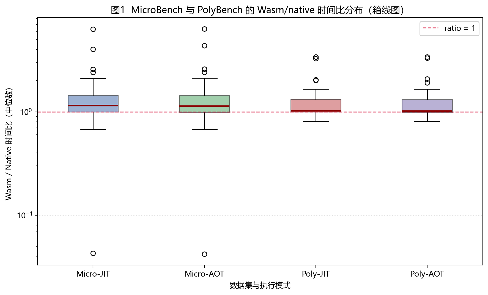
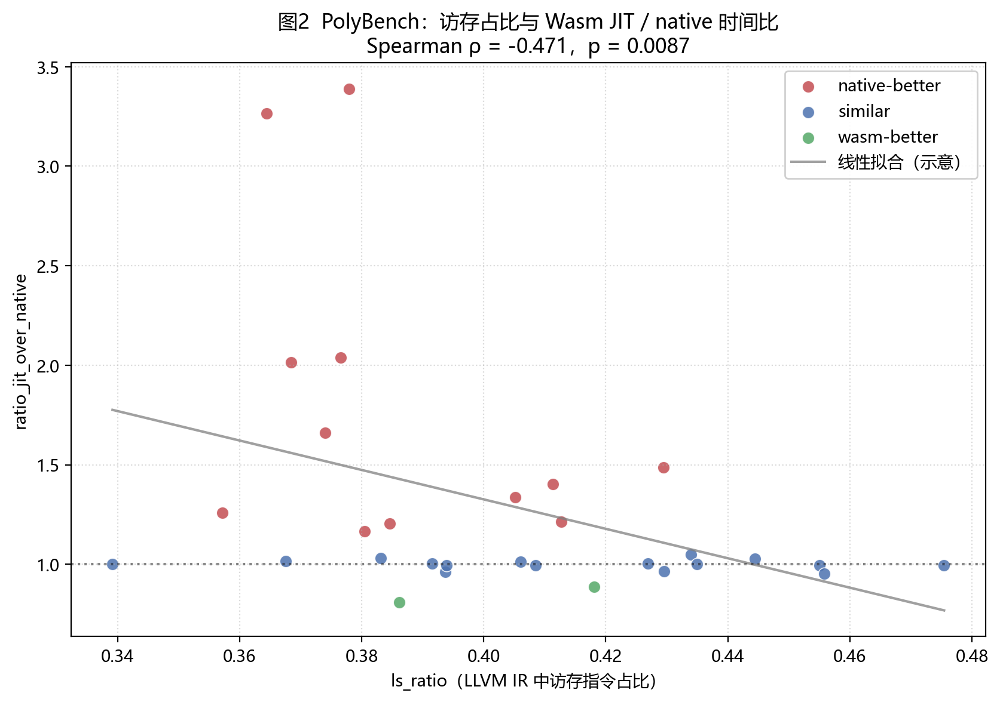
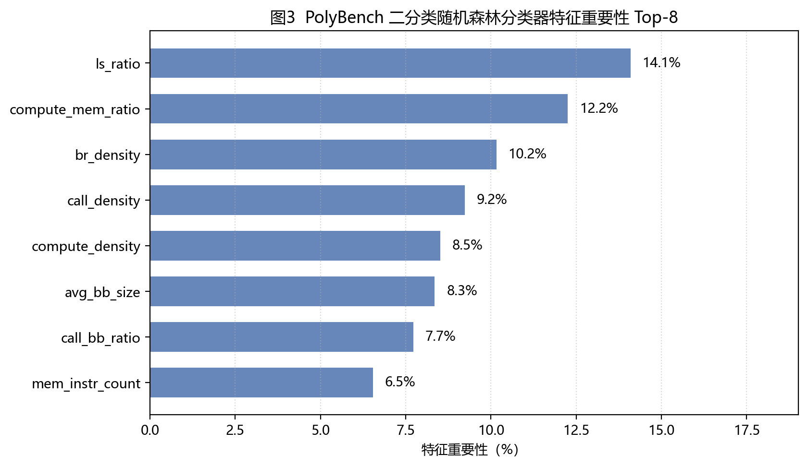

# WebAssembly与原生代码的性能分析


**摘要**：WebAssembly 在 WASI 等非浏览器场景中的部署日益增多，其与原生代码的相对性能及差异来源受到关注。现有工作多以运行时测量为主，基于程序静态结构对 Wasm 与 native 性能关系进行系统解释的研究仍相对不足。本文在统一容器环境与工具链配置下，以 C 语言程序为对象，比较 native、wasmtime 即时编译与预编译三种执行路径；采用与热点区域对齐的内部计时，在自建 MicroBenchmark（34 个）与 PolyBench kernel（30 个）上获取连续性能比值及离散标签，并从 LLVM IR 提取规模、控制流、计算与访存密度、调用与宿主交互等可解释特征。实验表明：宿主交互密集、动态分配活跃及控制流复杂的结构更易伴随 Wasm 相对 native 的明显劣势；在以 PolyBench 为代表的大规模数值核中，算术主导型热点常出现较大比值，且计算相关特征与比值呈同向统计趋势、访存占比特征呈反向趋势，该现象可用计算受限与带宽受限情形下后端优化空间差异等机制加以讨论；小型规整热点亦可能出现 Wasm 接近或略优于 native 的测量结果，且存在宿主调用类微基准的离群观测，说明不宜仅凭粗粒度程序类别外推相对性能。在此基础上，本文构造二分类任务并在留一法交叉验证下考察浅层模型的判别效果，结果表明静态特征具有一定信息量，但尚不足以单独支撑高风险自动化决策。全文结论建立在单一运行时与固定编译选项之上，是受控实验条件下的结构性观察。

**关键词**：WebAssembly；WASI；性能分析；LLVM IR；静态特征；原生代码


## 1. 绪论


### 1.1 研究背景与意义

WebAssembly 是一种新兴的二进制指令集架构和代码分发格式，最初由 Mozilla、Google、Microsoft 等厂商联合提出，旨在解决 Web 平台中高性能计算能力不足、跨语言支持受限以及代码可移植性差等问题[1]。Wasm 被设计为一种架构无关、可验证且安全的低级中间表示，具备安全、高效、可移植等特点，能够作为多种高级语言的统一编译目标。

自提出之初，WebAssembly 便被广泛应用于 Web 场景，在浏览器中为 C/C++ 等高级语言提供接近原生性能的执行能力。与 JavaScript 相比，Wasm 采用静态类型和结构化控制流，能够更好地支持编译器优化和高效执行。目前，WebAssembly 现已成为继 HTML，CSS，JavaScript 后的第 4 个 Web 语言标准规范，并得到了所有主流浏览器的支持。C/C++、C#、Go、Rust 等多种高级语言均提供了成熟的 Wasm 编译工具链，使得复杂计算逻辑可以安全地运行在浏览器沙箱中[2‑5]。

随着 WebAssembly 技术的成熟，其应用范围逐渐从 Web 扩展到非 Web 场景。2019 年，Mozilla 推出了 WebAssembly System Interface（WASI），为 Wasm 程序提供了一套标准化的操作系统接口，如文件系统访问、时间管理和网络通信等[6]。WASI 的引入使 Wasm 不再依赖浏览器环境，而是能够作为一种轻量级、安全的可移植执行单元运行于主机、云平台和边缘设备之上。在此背景下，WebAssembly 被视为容器和虚拟机之外的一种新型运行时抽象，在微服务、边缘计算、物联网等领域得到广泛的探索和实践[7‑8]。

随着 Wasm 应用场景的不断拓展，其性能特性逐渐成为研究关注的重点之一。已有大量工作从不同角度对 WebAssembly 的性能进行了分析评估，例如比较不同语言编译为 Wasm 后的执行效率差异[9]，分析主流 Wasm 运行时（如 wasmtime、wasmer、wasm3、WAMR 等）的性能表现[10‑11]，以及对 Wasm 与 JavaScript 或原生代码之间的性能差距进行实验性研究等[12‑14]。然而，现有研究大多基于运行时测量和基准测试结果，侧重于性能结果的对比，而对性能差异产生原因的分析仍较为有限，尤其缺乏基于程序静态特征的系统性研究。目前尚未有工作从静态分析角度出发，探讨如何在不实际运行程序的情况下判断程序是否适合以 WebAssembly 形式执行。

基于上述研究空白，本文提出了一种基于程序静态特征的方法，探索 WebAssembly 与原生代码之间性能差异的潜在原因。通过对程序中计算密集度、内存访问模式和控制流结构等静态特征进行建模，分析这些特征与性能表现之间的关联关系，为理解 WebAssembly 的性能边界提供新的视角。

通过本研究，期望为 WebAssembly 工具链与编译器优化、运行时优化及开发者进行技术选型等提供参考依据。例如，编译器在生成 Wasm 代码时可依据性能预测结果，有针对性地调整优化策略以缓解潜在性能瓶颈。此外，在云原生和边缘计算等场景中，系统可基于静态性能预测结果，在可移植性与执行效率之间进行权衡，决定采用 WebAssembly 还是原生部署方式，从而支持更为智能的任务调度与资源管理。


[1] Haas, Andreas, et al. "Bringing the web up to speed with WebAssembly." Proceedings of the 38th ACM SIGPLAN conference on programming language design and implementation. 2017.

[2] Mozilla Developer Network, “Compiling a new C/C++ module to WebAssembly,” [Online]. Available: https://developer.mozilla.org/en‑US/docs/WebAssembly/Guides/C_to_Wasm. [Accessed: Dec. 29, 2025].

[3] Mozilla Developer Network, “Compiling from Rust to WebAssembly.” [Online]. Available: https://developer.mozilla.org/en‑US/docs/WebAssembly/Rust_to_wasm. [Accessed: Dec. 29, 2025].

[4] Richard Musiol, “A compiler from Go to JavaScript for running Go code in a browser.” [Online]. Available: https://github.com/gopherjs/gopherjs. [Accessed: Dec. 29, 2025].

[5] Alon Zakai. Emscripten: An LLVM‑to‑JavaScript Compiler. In Proceedings of the ACM International Conference Companion on Object Oriented Programming Systems Languages and Applications Companion, OOPSLA ’11, pages 301–312. ACM, 2011.

[6] Lin Clark, “Standardizing WASI: A system interface to run WebAssembly outside the web.” [Online]. Available :https://hacks.mozilla.org/2019/03/standardizing‑wasi‑a‑webassembly‑system‑interface/. [Accessed: Dec. 29, 2025]

[7] Liu, Renju, Luis Garcia, and Mani Srivastava. "Aerogel: Lightweight access control framework for webassembly‑based bare‑metal iot devices." 2021 IEEE/ACM Symposium on Edge Computing (SEC). IEEE, 2021.

[8] Sok, Chanattan, et al. "WebAssembly serverless join: A Study of its Application." Proceedings of the 36th International Conference on Scientific and Statistical Database Management. 2024.

[9] Prabakar, Aiyatham, and Rishi Kiran. "WebAssembly Performance Analysis: A Comparative Study of C++ and Rust Implementations." (2024).

[10] Zhang, Yixuan, et al. "Research on webassembly runtimes: A survey." ACM Transactions on Software Engineering and Methodology 34.8 (2025): 1‑47.

[11] Dierickx, Arne. "Comparative study of the performance of WebAssembly runtimes."

[12] Jangda, Abhinav, et al. "Not so fast: Analyzing the performance of WebAssembly vs. native code." 2019 USENIX Annual Technical Conference (USENIX ATC 19). 2019.

[13] Sunarto, Joshua Wenata, et al. "A systematic review of webassembly vs javascript performance comparison." 2023 International Conference on Information Management and Technology (ICIMTech). IEEE, 2023.

[14] Yan, Yutian, et al. "Understanding the performance of webassembly applications." Proceedings of the 21st ACM Internet Measurement Conference. 2021.


### 1.2 论文结构安排

全文共分为六个章节。第一章为绪论，介绍研究背景与意义。第二章综述 WebAssembly 核心设计、相关性能研究以及静态特征分析相关工作。第三章介绍实验框架、基准程序设计、性能测量方法和数据集构建过程。第四章给出实验结果与统计分析，重点讨论静态特征与性能差距之间的关系，并结合异常程序开展案例分析。此外还建模了一个简单的分类模型对程序是否适合使用 WebAssembly 进行判别。第五章对实验发现进行讨论，分析其与已有工作的联系、实践意义以及研究局限。第六章总结全文工作，并展望未来可进一步扩展的数据集、特征设计和分析方法。


## 2. 相关工作


### 2.1 WebAssembly 核心设计

WebAssembly 最初面向 Web 应用提出，但其设计目标并不局限于浏览器，而是提供一种安全、紧凑、可验证且可移植的低级二进制表示[1]。从执行模型看，Wasm 的性能与安全特性主要建立在栈式虚拟机、线性内存和沙箱化隔离三项核心机制之上。这些机制既保证了模块能够以统一格式在不同平台上运行，也为浏览器内外场景中的快速验证、编译和部署提供了基础[1][19]。

1）栈式虚拟机

WebAssembly 采用栈式虚拟机设计，函数代码由一系列作用于隐式操作数栈的指令组成，即指令从栈顶弹出操作数并将结果重新压入栈中[1][19]。与寄存器式表示相比，栈式表示并不必然带来更高的执行速度，但能够有效减少字节码体积，使程序表示更加紧凑，这一点对于网络传输和跨平台分发尤为重要[19]。同时，Wasm 采用结构化控制流而非任意跳转，分支目标通过块嵌套关系表达，从而避免跳入非法位置或形成难以验证的控制流结构。这使得 Wasm 模块能够被单遍验证和单遍编译，降低了运行时加载与实现复杂度，并为后续优化提供了良好的基础[1]。

2）线性内存

Wasm 将程序主存设计为线性内存，即一段连续的字节数组，数据按照字节地址进行访问[1][19]。这一设计与传统程序的内存模型较为接近，便于 C/C++ 等语言将指针、数组和动态分配机制映射到 Wasm 执行环境中。在线性内存中，程序通过 load/store 指令完成数据读写，内存容量可以按页扩展，从而在保持抽象统一的同时支持较灵活的内存管理[1]。在 Web 场景下，该内存可以与 JavaScript 的 `ArrayBuffer` 交互；在非 Web 场景下，类似的线性地址空间也使 Wasm 运行时更容易与 WASI 等宿主接口对接[19]。更重要的是，所有内存访问都受到边界检查约束，越界访问将触发 trap，从而避免原生代码中常见的未定义行为直接破坏执行环境[1]。

3）沙箱设计

WebAssembly 的安全性还体现在其沙箱化执行模型上。Wasm 模块的线性内存与运行时内部数据结构、执行栈、本地变量以及其他进程内存相互隔离，模块无法直接访问宿主地址空间中的任意位置[1][19]。模块与外部环境的交互必须通过显式导入的宿主函数或系统接口完成，因此其可访问资源受到宿主环境的统一控制。这种设计使得不可信代码可以在同一地址空间中被安全执行，为浏览器中的脚本隔离、服务端 Wasm 运行时以及基于 WASI 的系统调用封装提供了基础[1][19]。也正因如此，WebAssembly 不仅是一种代码分发格式，更是一种兼顾安全隔离与执行效率的运行时抽象。


[19] Mao, Chenxi, et al. "eWAPA: An eBPF-based WASI Performance Analysis Framework for WebAssembly Runtimes." arXiv preprint arXiv:2409.10252 (2024).


### 2.2 WebAssembly 性能研究现状


现有关于 WebAssembly 性能的研究大致可分为运行时层面、编译与语言层面，以及浏览器应用层面的性能比较分析。

1）不同 WebAssembly 运行时性能对比[11]

随着 WebAssembly 从浏览器扩展到 WASI、边缘计算和服务端场景，越来越多的研究开始关注不同运行时之间的性能差异。相关综述指出，Wasmtime、Wasmer、WAMR、Wasm3、WasmEdge 等运行时在解释执行、JIT、AOT、启动开销、吞吐和内存占用等方面存在明显的设计取舍[10]。Dierickx 的比较研究也表明，不存在一种在所有 workload 上都稳定占优的通用运行时[11]。进一步地，面向 WASI 场景的研究发现，性能差异不仅来自 Wasm 字节码本身，也与系统接口实现密切相关。eWAPA 将运行时间进一步分解为总执行时间、启动时间、WASI 执行时间和 syscall 时间，指出运行时的 WASI 实现可能成为 I/O 密集程序的重要瓶颈[19]。Jiang 等针对 5 个服务端 Wasm 运行时开展差分测试，识别出多个已被开发者确认的性能问题，说明运行时内部实现细节会显著影响服务器侧 Wasm 的实际表现[21]。这类研究说明，Wasm 的性能具有较强的运行时依赖性。

2）不同编程语言编译为 WebAssembly 性能对比[9]

另一类研究关注源语言、编译器和优化选项对 Wasm 性能的影响。Prabakar 和 Kiran 对 C++ 与 Rust 实现编译为 WebAssembly 后的执行表现进行了比较，表明即使目标平台相同，不同语言生态和工具链仍会引入明显差异[9]。Yan 等的系统研究进一步指出，现有 Wasm 编译器大多建立在 LLVM 等通用编译基础设施之上，其优化并非专门针对 Wasm 设计，因此一些对原生代码有效的优化在 Wasm 上可能效果有限，甚至出现反直觉现象[14]。该研究同时表明，编译器选择与优化级别不仅影响执行时间，也会影响生成代码的内存使用和跨浏览器表现[14]。因此，现有语言对比研究揭示出 Wasm 性能并不仅仅取决于源语言本身，更与编译链路和后端优化策略密切相关。

3）基于 Web 的 WebAssembly 与 JavaScript 性能对比[13]

在浏览器场景下，Wasm 与 JavaScript 的比较是最早、也最丰富的一条研究主线。Sunarto 等对相关研究进行了系统综述，指出已有结论并不一致，性能结果会受到浏览器、设备、应用类型以及评价指标的共同影响[13]。Yan 等通过对 41 组程序在多浏览器和多输入规模下的实验发现，Wasm 并不总是稳定优于 JavaScript；JavaScript 的 JIT 优化收益更为显著，而 Wasm 在部分场景中并未因 JIT 获得同等幅度提升，同时其内存占用通常高于 JavaScript[14]。这一结论说明，Wasm 对 JavaScript 的优势更依赖于负载的计算密度以及初始化开销能否被后续执行摊薄，而不能简单概括为“Wasm 一定更快”。

此外，Wasm 与 native 的性能关系也并非简单的“接近原生”。Jangda 等基于 SPEC CPU 的研究指出，相比早期基于小型 PolyBench kernel 得出的乐观结论，更大规模应用中 Wasm 相对 native 仍存在显著差距，平均慢约 45% 到 55%，其原因包括额外的 load/store、branch 以及动态安全检查开销[12]。Spies 和 Mock 对非浏览器环境下 Wasm 的评估也表明，Wasm 在 Non-Web 场景中是否接近原生性能，仍高度依赖运行时、基准类型和系统交互方式[20]。

总体来看，现有工作已经从浏览器内的 JavaScript/Wasm 比较逐渐扩展到 native 对比、服务端运行时和 WASI 性能分析，为理解 WebAssembly 性能提供了重要基础。然而，多数研究仍以总体运行时间、启动开销或系统调用时间等动态指标为主，重点回答“谁更快”以及“运行时哪里慢”，而对程序本身的静态结构如何影响 Wasm 与 native 的性能差异关注不足。尤其在 Non-Web 场景下，仍缺少将程序静态特征与性能差距进行系统关联的研究。本文因此从静态特征角度出发，对 Non-Web 场景下 WebAssembly 与 Native 代码的性能差距及其结构性来源进行进一步分析。


[9] Prabakar, Aiyatham, and Rishi Kiran. "WebAssembly Performance Analysis: A Comparative Study of C++ and Rust Implementations." (2024).

[10] Zhang, Yixuan, et al. "Research on webassembly runtimes: A survey." ACM Transactions on Software Engineering and Methodology 34.8 (2025): 1‑47.

[11] Dierickx, Arne. "Comparative study of the performance of WebAssembly runtimes."

[13] Sunarto, Joshua Wenata, et al. "A systematic review of webassembly vs javascript performance comparison." 2023 International Conference on Information Management and Technology (ICIMTech). IEEE, 2023.

[14] Yan, Yutian, et al. "Understanding the performance of webassembly applications." Proceedings of the 21st ACM Internet Measurement Conference. 2021.

[20] Spies, Benjamin, and Michael Mock. "An evaluation of webassembly in non-web environments." 2021 XLVII Latin American Computing Conference (CLEI). IEEE, 2021.

[21] Jiang, Shuyao, Renzhi Zeng, Zelong Rao, Jialong Gu, Yiyu Zhou, and Michael R. Lyu. "Revealing performance issues in server-side webassembly runtimes via differential testing." 2023 38th IEEE/ACM International Conference on Automated Software Engineering (ASE). IEEE, 2023, pp. 661-672.


### 2.3 基于程序静态特征的性能分析相关研究


基于静态程序特征进行性能建模在系统与编译器领域已有较长研究基础。与依赖实际执行、硬件计数器或运行时插桩的动态分析方法相比，静态分析能够在不运行程序的前提下，从源码、抽象语法树（AST）或中间表示（IR）中提取程序规模、控制流结构、循环层次、指令类型和访存模式等信息，因此具有分析成本低、可迁移性强和可解释性较好的优势[15][22]。在编译优化研究中，Dubach 等提出基于代码特征的性能预测方法，利用程序特征估计不同优化方案带来的性能变化，以降低迭代编译搜索的代价[22]。这说明程序结构信息本身就能够为性能建模提供有效信号。

在更直接的静态性能预测研究中，Ardalani 等提出 Static XAPP 框架，仅基于 CPU 源代码的静态分析结果，在不运行和不剖析程序的情况下预测其跨架构迁移后的加速潜力[15]。该工作在 IR 层面设计了内存访问、分支发散、可并行性以及算术强度等特征，并借助机器学习模型对性能区间进行分类预测，取得了较高的准确率[15]。这一结果表明，即使缺少运行时信息，程序在编译中间表示上呈现出的结构属性仍然能够反映其在不同执行平台上的性能行为。对本文而言，这一点具有直接启发：Wasm 与 native 虽然运行时和代码生成链路不同，但二者之间的性能差异同样可能与计算密度、访存密度、控制流复杂度及调用行为等静态结构特征有关。

除人工设计的统计特征外，近年来也有研究尝试直接利用代码结构开展静态性能分析。Pinnow 等将源代码表示为 AST，并采用比较式建模方法预测两个正确程序版本中哪一个运行更快[23]。该研究指出，绝对执行时间会受到输入规模、系统环境和硬件细节等多种因素影响，单纯依赖静态信息进行绝对性能预测通常较为困难；相较之下，基于代码结构差异的相对性能判断更具可行性[23]。这一思路与本文的研究目标具有一致性。本文并不试图脱离具体实验环境预测程序的绝对运行时间，而是关注同一程序在 native、Wasm JIT 和 Wasm AOT 下的相对性能差异，并进一步分析这些差异与静态特征之间的关系。

综上，使用静态分析支撑本文研究在方法论上是合理的。一方面，静态特征可在大规模 benchmark 上低成本、统一地提取，便于开展后续统计分析；另一方面，这些特征具有较强可解释性，能够帮助我们从程序结构角度讨论 Wasm 与 native 性能差距的潜在来源。需要说明的是，本文并不以静态特征替代动态测量，而是将静态分析与实测性能结果结合起来，用于解释性能差异，而非单独进行黑盒预测。


[15] Ardalani, Newsha, et al. "A static analysis‑based cross‑architecture performance prediction using machine learning." arXiv preprint arXiv:1906.07840 (2019).

[22] Dubach, Christophe, John Cavazos, Bjoern Franke, Michael F. P. O'Boyle, Grigori Fursin, and Olivier Temam. "Fast compiler optimisation evaluation using code-feature based performance prediction." Proceedings of the ACM International Conference on Computing Frontiers. 2007.

[23] Pinnow, Nathan, Tarek Ramadan, Tanzima Z. Islam, Chase Phelps, and Jayaraman J. Thiagarajan. "Comparative code structure analysis using deep learning for performance prediction." arXiv preprint arXiv:2102.07660 (2021).


## 3. 方法论


### 3.1 特征空间构建

本文的目标并非仅根据静态信息直接预测程序的绝对运行时间，而是通过可解释的程序结构特征，分析同一程序在 native、Wasm JIT 与 Wasm AOT 下为何会表现出不同的相对性能。因此，特征空间构建需要同时服务于“可比较”和“可解释”两个目标。结合第 2 章相关工作可知，Wasm 与 native 的性能差异通常与计算密度、访存模式、控制流复杂度以及宿主交互开销有关[12][15][19][21]。据此，本文围绕程序规模、控制流、计算、内存访问、函数调用以及系统交互等维度构建静态特征集合。

在具体设计上，本文遵循以下原则：第一，特征应具有明确的程序语义，能够对应到计算、分支、访存或系统交互等具体行为，而不是难以解释的黑盒表示；第二，特征应尽可能与实际计时区域保持一致，使特征能够描述真正参与性能形成的核心代码，而非初始化或辅助逻辑；第三，特征应能够从 LLVM IR、控制流图及循环分析结果中稳定提取，以保证不同 benchmark 之间具有统一的分析口径；第四，除绝对计数外，还需构造密度与比率特征，以削弱程序规模差异对跨 benchmark 比较的干扰[15][23]。基于上述原则，本文设计了如下特征空间：


| **特征类别**  | **特征名称**          | **定义 / 计算方式**                       | **提取来源** | **类型** | **设计动机 (Motivation)**                                    |
| ------------- | --------------------- | ----------------------------------------- | ------------ | -------- | ------------------------------------------------------------ |
| **总规模**    | `total_instr_count`   | LLVM IR 指令总数                          | IR           | 规模     | 衡量程序整体规模与静态复杂度。                               |
| **控制流**    | `basic_block_count`   | 基本块（Basic Block）的总数量             | IR           | CFG 规模 | 反映程序控制流的切分程度与复杂性。                           |
|               | `avg_bb_size`         | `total_instr_count / basic_block_count`   | DERIVED      | CFG 密度 | 平均基本块大小。大则长直线段多，易于 JIT 优化；小则控制流碎片化。 |
|               | `avg_bb_out_degree`   | 所有基本块出度的平均值                    | IR/CFG       | 控制流   | 反映逻辑分支的密集程度。                                     |
|               | `max_loop_depth`      | 最大循环嵌套层数                          | IR/LoopInfo  | 结构     | 衡量计算核心的拓扑深度，影响缓存命中率与并行潜力。           |
|               | `loop_instr_count`    | 处于循环体内的指令总数                    | IR/LoopInfo  | 规模     | 反映程序中“热点区域”的静态覆盖范围。                         |
|               | `br_instr_count`      | 分支指令 (Branch/Switch) 总数             | IR           | 指令统计 | 衡量程序逻辑判断的绝对数量。                                 |
|               | `br_density`          | `br_instr_count / total_instr_count`      | DERIVED      | 比例     | 反映程序是非线性逻辑密集型（如解析器）还是线性计算型。       |
| **计算**      | `compute_instr_count` | 算术、逻辑及位运算指令总数                | IR           | 指令统计 | 衡量程序执行计算任务的绝对工作量。                           |
|               | `compute_density`     | `compute_instr_count / total_instr_count` | DERIVED      | 比例     | 表征程序是否为计算密集型 (Compute-bound)。                   |
| **内存访问**  | `mem_instr_count`     | Load 与 Store 指令的总和                  | IR           | 指令统计 | 衡量程序对内存子系统的压力。                                 |
|               | `ls_ratio`            | `mem_instr_count / total_instr_count`     | DERIVED      | 比例     | 指示内存访问频率，用于评估访存带宽需求。                     |
| **函数/系统** | `func_count`          | 函数定义总数                              | IR           | 规模     | 衡量模块化程度及过程间分析的成本。                           |
|               | `call_instr_count`    | Call 指令（含直接调用）总数               | IR           | 指令统计 | 衡量函数间的交互频繁度。                                     |
|               | `indirect_call_count` | 通过函数指针进行的间接调用数              | IR           | 复杂度   | 衡量控制流图（CFG）的不确定性及去虚化难度。                  |
|               | `call_density`        | `call_instr_count / total_instr_count`    | DERIVED      | 比例     | 反映代码的抽象层次；高密度通常意味着频繁的上下文切换。       |
|               | `syscall_count`       | 系统调用相关指令（IO、文件、时间）        | IR/Lib       | 行为     | 衡量程序与操作系统内核交互的频率。                           |
|               | `syscall_density`     | `syscall_count / total_instr_count`       | DERIVED      | 比例     | 区分用户态计算密集与系统态行为密集任务。                     |
| **IO**        | `io_call_count`       | 涉及输入输出（读写、网络）的调用数        | IR/Lib       | 行为     | 衡量 IO 密集程度，评估程序执行中的阻塞潜力。                 |
|               | `io_density`          | `io_call_count / total_instr_count`       | DERIVED      | 比例     | 表征程序是 IO-bound 还是 CPU-bound。                         |
| **复合比率**  | `compute_mem_ratio`   | `compute_instr_count / mem_instr_count`   | DERIVED      | 效率     | **关键指标**：类似计算强度（Operational Intensity），判断瓶颈位置。 |
|               | `call_bb_ratio`       | `call_instr_count / basic_block_count`    | DERIVED      | 结构     | 衡量每个基本块内的平均调用数，反映控制流受外部调用影响的程度。 |


上述特征可以分为两类理解。第一类是绝对规模特征，例如 `total_instr_count`、`basic_block_count`、`loop_instr_count`、`compute_instr_count` 和 `mem_instr_count`，它们用于保留程序的静态工作量信息，反映程序本身“有多大”“热点区域有多重”。第二类是归一化后的结构特征，例如 `br_density`、`compute_density`、`ls_ratio`、`call_density`、`syscall_density` 和 `io_density`，它们通过相对比例刻画程序“更偏向什么结构”，从而使不同规模的 benchmark 之间具有可比性。换言之，前者强调绝对复杂度，后者强调结构倾向，二者结合后更适合用于后续相关性分析与分组比较。

其中，`compute_mem_ratio` 是本文重点关注的复合指标。该指标类似于高性能计算中常用的计算强度概念，用于刻画单位访存操作对应的计算量。当该值较高时，程序往往更偏向计算密集型；当该值较低时，程序更可能受数据搬运和内存访问限制。考虑到 Wasm 运行时在寄存器分配、内存访问组织和边界检查上的额外开销可能对不同程序结构产生不同影响，这一指标有望成为解释 Wasm 与 native 性能差异的重要线索。相比之下，`call_bb_ratio` 用于补充刻画调用行为在局部控制流中的分布特征，避免仅用 `call_instr_count` 无法反映“调用是否集中嵌入细碎基本块”这一结构差异。

对于 `syscall_count` 和 `io_call_count`，本文并不试图在机器指令层面逐条恢复真实系统调用，而是通过识别 LLVM IR 中与时间、文件、目录、环境变量、标准输入输出以及读写操作相关的库调用或导入接口，近似衡量程序与宿主环境交互的强弱。这样设计的原因在于，已有研究表明，在 WASI 和服务端 Wasm 场景中，运行时对系统接口的实现质量会显著影响实际性能[19][21]。因此，将系统调用和 IO 交互作为单独特征纳入分析，有助于识别 Wasm 在 Non-Web 场景下可能暴露的额外成本来源。

总体而言，本文构建的特征空间以可解释性优先，而非追求最复杂的预测模型输入。其主要作用是为后续实验结果分析提供统一、稳定且具有结构语义的描述框架，从而回答“哪些静态结构更容易使 Wasm 接近 native，哪些结构更可能导致明显性能损失”这一核心研究问题。


### 3.2 Benchmark构建


为了兼顾机制解释能力与实验结果的代表性，本文采用“自建微基准程序 + 公开 benchmark 套件”相结合的方式构建实验对象。其中，微基准程序用于有控制地放大某一类静态结构特征，便于观察单一因素对 Wasm 与 native 性能差异的影响；公开 benchmark 则用于检验这些结构因素在更完整、更加真实的数值计算程序中是否仍然成立。这样的组合设计有助于避免仅依赖单一 benchmark 类型所带来的结论片面性。

在 benchmark 选择上，本文主要遵循三项原则。第一，结构覆盖性，即尽可能覆盖计算、访存、分支、调用、宿主交互和内存分配等多类程序行为；第二，可控性，即在微基准中尽量让目标结构成为主导因素，减少多因素耦合造成的解释困难；第三，可比性，即所有程序均采用统一的编译链路、运行模式和计时方式，从而保证 native、Wasm JIT 与 Wasm AOT 之间的实验结果具有横向可比性。


MicroBenchmark 设计如：

| 类别                       | 数量   | 程序列表（文件名前缀）                                       |
| -------------------------- | ------ | ------------------------------------------------------------ |
| B1. Compute-heavy          | 5      | `compute_int_add`, `compute_int_mul`, `compute_int_divmod`, `compute_fp_mix`, `compute_fp_muladd` |
| B2. Memory-heavy           | 7      | `memory_seq_read`, `memory_seq_write`, `memory_stride_read`, `memory_stride_write`, `memory_random_read`, `memory_random_write`, `memory_copy_loop` |
| B3. Branch-heavy           | 5      | `branch_predictable`, `branch_unpredictable`, `branch_nested`, `branch_switch_dense`, `branch_switch_sparse` |
| B4. Call-heavy             | 4      | `call_chain`, `call_indirect`, `call_recursive`, `call_many_small_funcs` |
| B5. Host-interaction-heavy | 7      | `host_time_loop`, `host_getcwd_loop`, `host_env_query`, `host_stat_loop`, `host_read_small`, `host_write_small`, `host_open_close_loop` |
| B6. Allocation-heavy       | 6      | `alloc_small_objects`, `alloc_bulk_buffer`, `alloc_medium_objects`, `alloc_realloc_loop`, `alloc_pool_style`, `alloc_fragmented_pattern` |
| **合计**                   | **34** |                                                              |


上述 34 个微基准程序并不追求模拟完整应用，而是服务于“结构可控”的分析目标。`Compute-heavy` 组重点考察算术运算占主导时的执行特征；`Memory-heavy` 组通过顺序、跨步、随机访问及拷贝模式区分不同访存行为；`Branch-heavy` 组通过可预测分支、不可预测分支、嵌套分支与 `switch` 结构观察控制流复杂度的影响；`Call-heavy` 组用于衡量函数调用链、间接调用和递归对运行时的压力；`Host-interaction-heavy` 组突出时间、目录、环境变量、文件状态和读写等宿主接口调用，以观察 Wasm 与宿主环境交互时可能引入的额外开销；`Allocation-heavy` 组则用于分析动态分配、重分配和碎片化分配模式下的性能差异。通过这种分组方式，可以较清晰地建立“特定结构特征”与“性能变化方向”之间的对应关系。

与微基准不同，PolyBench 提供了一组结构更完整、在编译与体系结构研究中被广泛使用的数值计算 kernel。本文采用其中 30 个 kernel，涵盖矩阵乘法与线性代数计算、协方差与相关性统计、Jacobi/Seidel/Heat/FDTD 等 stencil 计算，以及 `floyd-warshall`、`nussinov` 等具有代表性的动态规划和图算法内核。相较于包含大量系统调用或复杂框架代码的真实应用，这些 kernel 具有循环结构清晰、控制流规则、I/O 干扰较少的特点，因此更适合用于观察计算密度、访存密度和循环层次等静态特征与性能差异之间的关系。同时，PolyBench 也曾被用于早期 Wasm 性能研究，因而具有较好的横向可比性[12]。

综合来看，微基准程序与 PolyBench 在本文中承担了互补角色。前者强调局部机制与因果解释，帮助识别某一类结构是否可能成为 Wasm 的性能敏感点；后者强调更高层次的程序完整性与结果稳定性，用于验证这些结构性规律是否能够迁移到规则数值计算 workload 中。二者结合后，既能够提高结论的可解释性，也有助于增强实验发现的外部有效性。


[12] Jangda, Abhinav, et al. "Not so fast: Analyzing the performance of WebAssembly vs. native code." 2019 USENIX Annual Technical Conference (USENIX ATC 19). 2019.


### 3.3 性能测量方法


为了尽可能刻画程序核心计算区域的执行差异，而不是把进程创建、模块加载、运行时初始化或一次性编译成本混入结果中，本文对 MicroBenchmark 和 PolyBench 均采用内部计时（internal timing）作为主要性能测量方式。相较于直接从外部记录整个程序的 wall-clock 时间，内部计时能够更准确地对齐到被研究的代码区域，使性能结果与前文提取的静态特征保持更高一致性[12][19]。因此，本文测量的重点是 steady-state 的核心执行阶段，而非端到端启动时延。

对于 MicroBenchmark，我们在程序内部对核心代码区域进行显式插桩，计时结构示意如下：


```c
int main(void) {
    // timer starts
    struct timespec __ts_start, __ts_end;
    unsigned long long __time_ns = 0;
    clock_gettime(CLOCK_MONOTONIC, &__ts_start);
    
    // code ……
    
    // timer stops
    clock_gettime(CLOCK_MONOTONIC, &__ts_end);
    __time_ns = (unsigned long long)(__ts_end.tv_sec - __ts_start.tv_sec) * 1000000000ull;
    if (__ts_end.tv_nsec >= __ts_start.tv_nsec) {
        __time_ns += (unsigned long long)(__ts_end.tv_nsec - __ts_start.tv_nsec);
    } else {
        __time_ns -= 1000000000ull;
        __time_ns += (unsigned long long)(__ts_end.tv_nsec + 1000000000L - __ts_start.tv_nsec);
    }
    printf("TIME_NS:%llu\n", __time_ns);
    return 0;
}
```

其中，计时器采用 `clock_gettime(CLOCK_MONOTONIC, ...)` 获取单调时钟，输出格式统一为 `TIME_NS:<integer>`。计时开始位置设置在进入核心计算区域之前，结束位置位于核心区域完成之后，因此测得的是 benchmark 主体逻辑的内部执行时间，不包含最终打印时间，也尽量避免了外部命令调度与壳层开销的干扰。

此外，为了提高测量信号强度并降低定时分辨率与瞬时扰动带来的影响，每个微基准程序都将核心语句封装在循环结构中，并根据不同程序的执行特征设置合适的循环次数，使单次测量结果既足够稳定，又不会长到引入额外超时风险。对于每一种执行模式（native、Wasm JIT、Wasm AOT），本文先进行 2 次 warmup 运行，warmup 结果不计入统计；随后正式运行 30 次，记录每次解析得到的内部时间，并统一换算为毫秒。对 30 次结果进一步计算均值、中位数、标准差、最小值和最大值，其中中位数作为后续比较的代表值，以增强对偶发系统噪声和离群点的鲁棒性。

在此基础上，本文定义连续性能指标：

`ratio_jit_over_native = median_jit_internal_ms / median_native_internal_ms`

`ratio_aot_over_native = median_aot_internal_ms / median_native_internal_ms`

其中，`median_native_internal_ms`、`median_jit_internal_ms` 和 `median_aot_internal_ms` 分别表示三种执行模式在 30 次正式运行中的内部计时中位数。若 ratio 大于 1，则表示对应 Wasm 模式慢于 native；若 ratio 小于 1，则表示对应 Wasm 模式快于 native。为了便于后续统计分析，本文进一步采用 10% 阈值将连续比值映射为三类标签：当 `ratio > 1.10` 时记为 `native-better`，当 `ratio < 0.90` 时记为 `wasm-better`，其余情况记为 `similar`。需要强调的是，标签仅是连续 ratio 的派生结果，后续分析仍以连续指标为主。

对于 PolyBench，本文同样采用 benchmark 内部计时，但计时逻辑复用其自带的 `POLYBENCH_TIME` 内部计时器。具体而言，各 kernel 在 `polybench_start_instruments`、`polybench_stop_instruments` 和 `polybench_print_instruments` 宏之间完成核心计算区域的测量，计时范围天然限定在 kernel 主体内部。考虑到原始 PolyBench 计时路径在 WASI 目标下对 `gettimeofday()` 的依赖会带来兼容性问题，本文在 WASI 版本中将其适配为基于 `clock_gettime(CLOCK_MONOTONIC, ...)` 的实现，从而保证 native 与 Wasm 在计时语义上保持一致。脚本侧则对 PolyBench 的数字输出进行统一解析，并换算为毫秒用于后续分析。

PolyBench 的运行协议与 MicroBenchmark 保持一致：三种执行模式均先进行 2 次 warmup，再进行 30 次正式测量，并使用内部计时中位数作为该 kernel 的最终运行时间。对于 AOT 模式，预编译产物在主测量循环之外提前生成，因此 AOT 结果表示预编译 artifact 的执行时间，而不包含一次性的预编译开销。由此，本文在 MicroBenchmark 与 PolyBench 上获得的时间数据具有统一口径，可直接用于后续的 ratio 计算、标签划分以及相关性分析。


## 4. 实验与分析


### 4.1 实验设置


本文统一选择 C 语言作为实验对象。一方面，C 语言同时具备成熟的原生编译链与 WASI 工具链支持，便于在不改变核心算法逻辑的前提下生成 native 可执行文件与 Wasm 模块；另一方面，C 源程序便于进一步导出 LLVM IR，用于后续静态特征提取与结构分析。所有实验均在统一的 Docker 容器环境中完成，容器基于官方 `wasi-sdk` 镜像构建，并在其中安装原生 `clang` 与 `wasmtime`，以尽量降低主机环境差异对实验结果的影响。

本文比较三种执行模式：`native`、`Wasm JIT` 与 `Wasm AOT`。其中，`native` 模式将 C 源程序编译为 Linux 本地可执行文件后直接运行；`Wasm JIT` 模式先将同一份 C 源程序编译为 `wasm32-wasip1` 目标的 Wasm 字节码，再由 `wasmtime` 在运行时即时编译并执行；`Wasm AOT` 模式则先使用 `wasmtime compile` 将 Wasm 模块预编译为可执行 artifact，再通过允许预编译产物的方式运行。这样设置的目的在于，在相同源程序与相同运行时家族下，对比 native、Wasm 动态编译执行和 Wasm 预编译执行三种路径的性能差异。

具体工具链方面，原生代码使用 `clang 18.1.3` [16] 编译，Wasm 代码使用 `wasi-sdk 22.1.0` [17] 提供的 `/opt/wasi-sdk/bin/clang` 编译，目标三元组为 `wasm32-wasip1`；运行时统一采用 `wasmtime 43.0.0` [18]。对于需要访问当前工作目录中文件的程序，Wasm 执行时通过 `--dir=.` 提供最小必要的目录权限，以保证 native 与 Wasm 在输入输出条件上保持一致。

为减少编译优化等级成为额外干扰因素，本文在每类 benchmark 内部保持固定编译配置。MicroBenchmark 主流水线使用 `-O2`，并同时生成 native 二进制、Wasm 模块与 LLVM IR；PolyBench 采用启用 `POLYBENCH_TIME` 的内部计时构建脚本，在 native 与 Wasm 两条路径上使用对称的优化编译流程。本文并不将不同优化等级作为独立自变量进行比较，因此实验重点放在执行模式差异与程序结构差异上，而非编译选项调优本身。

除工具链与执行模式外，实验流程还保持以下一致性：同一 benchmark 在三种模式下使用相同源程序、相同输入规模、相同计时策略和相同重复运行协议；AOT 预编译开销被放置在主测量循环之外，不计入最终内部执行时间。由此可以保证后续得到的连续性能指标主要反映执行模式本身的差异，而不是环境配置不一致带来的偏差。


[16] “Clang: a C language family frontend for LLVM.” Accessed: Apr. 04, 2026. [Online]. Available: https://clang.llvm.org/

[17] “WASI SDK.” Accessed: Apr. 04, 2026. [Online]. Available: https://github.com/WebAssembly/wasi-sdk

[18] "Wasmtime." Accessed: Apr. 04, 2026. [Online]. Available: https://wasmtime.dev/


### 4.2 实验结果

本节报告 34 个 MicroBenchmark 与 30 个 PolyBench kernel 在三种执行模式（native、Wasm JIT、Wasm AOT）下的内部计时对比结果。性能指标采用第 3 章定义的连续比值 `ratio_jit_over_native` 与 `ratio_aot_over_native`，并以 10% 为阈值将其映射为 `native-better`、`similar`、`wasm-better` 三类离散标签。

**总体分布**

表 4-1 汇总了两类数据集在 JIT 与 AOT 模式下的标签分布及 ratio 描述性统计。

表 4-1　两类数据集的标签分布与 ratio 描述性统计（阈值 10%）

| 数据集                 | 执行模式 | native-better |   similar   | wasm-better | 均值 | 中位数 | 标准差 | 最小值 | 最大值 |
| :--------------------- | :------- | :-----------: | :---------: | :---------: | :--: | :----: | :----: | :----: | :----: |
| MicroBenchmark（n=34） | Wasm JIT |  18（52.9%）  | 10（29.4%） | 6（17.6%）  | 1.44 |  1.15  |  1.09  |  0.04  |  6.29  |
| MicroBenchmark（n=34） | Wasm AOT |  18（52.9%）  | 10（29.4%） | 6（17.6%）  | 1.45 |  1.15  |  1.12  |  0.04  |  6.33  |
| PolyBench（n=30）      | Wasm JIT |  12（40.0%）  | 16（53.3%） |  2（6.7%）  | 1.30 |  1.01  |  0.62  |  0.81  |  3.39  |
| PolyBench（n=30）      | Wasm AOT |  12（40.0%）  | 16（53.3%） |  2（6.7%）  | 1.30 |  1.01  |  0.62  |  0.81  |  3.40  |

> 注：ratio 定义为 Wasm 与 native 内部计时中位数之比，大于 1 表示 Wasm 慢于 native；MicroBenchmark 的 JIT 与 AOT 标签完全一致。

由表 4-1 可见，两类数据集的标签分布存在明显差异：MicroBenchmark 中 `native-better` 占比超过半数（52.9%），而 PolyBench 中 `similar` 为主体类别（53.3%）。这一对比表明，在人工构造的局部特征突出的微基准中，执行模式差异更容易被放大；而在结构更为完整的 PolyBench 数值核中，Wasm 与 native 的执行时间更趋接近。从 ratio 的分散程度来看，MicroBenchmark 的标准差（约 1.09）显著大于 PolyBench（约 0.62），且存在 `host_time_loop`（ratio ≈ 6.29）和 `host_getcwd_loop`（ratio ≈ 0.04）两个极端离群观测，说明该套件对程序结构的差异更为敏感。图 4-1 以箱线图形式直观呈现了四组 ratio 的分布差异。



值得注意的是，JIT 与 AOT 在两类数据集上的标签分布完全一致，均未出现类别翻转，AOT 相对于 JIT 仅在少数样本上产生小幅差异。这表明，在本实验设置下，是否采用预编译执行路径并非决定 Wasm 相对性能类别归属的主要因素；程序结构本身（控制流复杂度、计算与访存比例、宿主交互模式等）对结果的影响更为关键。

**MicroBenchmark 分类分析**

表 4-2 按程序类别（B1—B6）进一步给出 MicroBenchmark 的标签分布。

表 4-2　MicroBenchmark 各类别程序标签分布（JIT 标签）

| 类别                                      | 数量 | native-better | similar | wasm-better |
| :---------------------------------------- | :--: | :-----------: | :-----: | :---------: |
| B1 计算密集（Compute-heavy）              |  5   |       0       |    4    |      1      |
| B2 访存密集（Memory-heavy）               |  7   |       4       |    2    |      1      |
| B3 分支密集（Branch-heavy）               |  5   |       1       |    1    |      3      |
| B4 调用密集（Call-heavy）                 |  4   |       3       |    1    |      0      |
| B5 宿主交互密集（Host-interaction-heavy） |  7   |       6       |    0    |      1      |
| B6 内存分配密集（Allocation-heavy）       |  6   |       4       |    2    |      0      |
| 合计                                      |  34  |      18       |   10    |      6      |

表 4-2 揭示出鲜明的类别规律：宿主交互密集组（B5）的 7 个程序中有 6 个被标记为 `native-better`，内存分配密集组（B6）和调用密集组（B4）亦以 `native-better` 为主；而计算密集组（B1）全部落入 `similar` 或 `wasm-better`，分支密集组（B3）中有 3 个程序的 ratio 低于 0.90，属于 Wasm 占优的情形。这一分布表明，程序行为类别与 Wasm/native 相对性能之间存在较为清晰的结构性对应关系。

宿主交互密集型程序的 Wasm 相对劣势最为突出，典型代表为 `host_time_loop`（ratio ≈ 6.29）、`host_env_query`（ratio ≈ 4.03）和 `host_stat_loop`（ratio ≈ 2.05）。其原因在于：Wasm 沙箱模型要求所有宿主接口调用经由固定的导入路径完成，无法绕过运行时调度层；当程序在计时区域内高频且反复穿越 Wasm/WASI 边界时，每次调用的固定跨边界开销在总时间中的占比急剧上升，从而放大了 Wasm 与 native 的差距。内存分配密集型程序（如 `alloc_medium_objects`，ratio ≈ 2.41；`alloc_small_objects`，ratio ≈ 2.11）的 Wasm 相对劣势，则可能与线性内存模型对分配器路径及访存局部性的约束有关。控制流不规则程序（如 `branch_unpredictable`，ratio ≈ 2.58）的 Wasm 劣势，可初步归因于难以预测的分支在 Wasm 代码生成路径上的优化机会受限，但需结合性能计数器进一步验证。

与上述类别相对，分支规整程序和纯计算程序更易出现 Wasm 接近或优于 native 的结果。`branch_predictable`、`branch_switch_dense`、`branch_switch_sparse` 的 JIT ratio 分别为 0.74、0.77 和 0.68；`compute_int_add` 的 ratio 为 0.78。这说明在热点集中、控制流简单、宿主依赖低的微程序中，Wasmtime JIT 生成的本机代码质量足以匹敌乃至略微超越直接编译的 native 二进制。需要特别指出的是，`host_getcwd_loop` 的 ratio 约 0.04，与"宿主交互导致 Wasm 相对劣势"的主体规律方向相反，构成显著离群观测；其可能原因将在 4.3 节进行专项讨论，此处结论不具推广性。

**PolyBench 详细结果**

表 4-3 列出全部 30 个 PolyBench kernel 按 JIT ratio 降序排列的结果，图 4-2 则展示 `ls_ratio`（IR 中访存指令占比）与 `ratio_jit_over_native` 之间的散点关系。

表 4-3　PolyBench 各 kernel 的 Wasm JIT/AOT ratio 及标签（按 JIT ratio 降序）

| 程序             | JIT ratio | AOT ratio |     标签      |
| :--------------- | :-------: | :-------: | :-----------: |
| `gemm`           |   3.39    |   3.40    | native-better |
| `jacobi-1d`      |   3.27    |   3.30    | native-better |
| `heat-3d`        |   2.04    |   2.07    | native-better |
| `jacobi-2d`      |   2.02    |   1.90    | native-better |
| `syrk`           |   1.64    |   1.64    | native-better |
| `durbin`         |   1.49    |   1.49    | native-better |
| `atax`           |   1.40    |   1.33    | native-better |
| `fdtd-2d`        |   1.34    |   1.34    | native-better |
| `floyd-warshall` |   1.26    |   1.26    | native-better |
| `2mm`            |   1.22    |   1.24    | native-better |
| `doitgen`        |   1.21    |   1.20    | native-better |
| `nussinov`       |   1.16    |   1.18    | native-better |
| `trisolv`        |   1.05    |   1.07    |    similar    |
| `adi`            |   1.04    |   1.05    |    similar    |
| `gemver`         |   1.04    |   0.96    |    similar    |
| `trmm`           |   1.03    |   1.03    |    similar    |
| `3mm`            |   1.01    |   1.01    |    similar    |
| `bicg`           |   1.01    |   1.00    |    similar    |
| `seidel-2d`      |   1.00    |   1.00    |    similar    |
| `cholesky`       |   1.00    |   1.00    |    similar    |
| `covariance`     |   1.00    |   0.98    |    similar    |
| `mvt`            |   1.00    |   0.93    |    similar    |
| `symm`           |   0.99    |   1.01    |    similar    |
| `correlation`    |   0.99    |   0.98    |    similar    |
| `deriche`        |   0.99    |   0.99    |    similar    |
| `gesummv`        |   0.98    |   0.97    |    similar    |
| `ludcmp`         |   0.96    |   0.96    |    similar    |
| `lu`             |   0.96    |   0.97    |    similar    |
| `gramschmidt`    |   0.89    |   0.86    |  wasm-better  |
| `syr2k`          |   0.81    |   0.80    |  wasm-better  |

> 注：ratio 值取内部计时中位数之比，保留两位小数；标签依 10% 阈值划分。





由表 4-3 可见，ratio 排名靠前（native 相对优势较大）的 kernel 多为计算密集型数值核，如 `gemm`（ratio ≈ 3.39）、`jacobi-1d`（ratio ≈ 3.27）、`heat-3d`（ratio ≈ 2.04）和 `jacobi-2d`（ratio ≈ 2.02）；排名靠后（Wasm 接近或优于 native）的 kernel 则多为访存比例较高的矩阵运算，如 `syr2k`（ratio ≈ 0.81）和 `gramschmidt`（ratio ≈ 0.89）。图 4-2 进一步证实了这一趋势：`ls_ratio`（IR 中访存指令占比）与 `ratio_jit_over_native` 之间呈现统计显著的负相关关系（Spearman ρ ≈ −0.47，p = 0.009），即访存指令占比越高的 kernel，Wasm JIT 相对于 native 的时间比越低。相应地，`compute_mem_ratio`（计算/访存比）和 `compute_density`（计算指令密度）与 ratio 呈正向变动趋势（p < 0.05），意味着计算强度越高，Wasm 的相对劣势越明显。

上述统计关联可在屋顶线（roofline）模型框架下给出定性解释。当 kernel 属于计算受限型（compute-bound）时，执行性能对向量化程度、寄存器分配与指令调度等后端优化高度敏感；native 侧编译器直接面向目标 ISA，对长内层循环施加 SIMD 化等优化的空间通常较大，而 Wasm 经由栈机字节码到运行时 JIT/AOT 本机代码的翻译路径在优化深度与指令形态上与 native 不完全等价，代码生成质量的差异在算术强度较高的循环中被反复累积，从而产生显著的 ratio 上升。反之，当 kernel 属于带宽受限型（memory-bound）时，执行时间主要取决于缓存缺失与内存带宽等待；在相近的存储层次瓶颈约束下，Wasm 因线性内存与边界检查引入的额外指令在总时间中的相对权重降低，native 在计算侧可获得的编译优化收益亦受访存延迟制约，两种实现的 ratio 差距趋于收敛。需要指出的是，上述解释属于机制层面的工作假说，在本实验条件下尚未通过硬件性能计数器加以直接验证，有待后续研究进一步检验。


**本节小结**

综合以上分析，Wasm 与 native 的相对性能受程序结构与负载类型的显著调制，不宜一概而论。在 MicroBenchmark 中，以宿主接口调用为主导的程序表现出最为明显的 Wasm 相对劣势，而控制流规整、外部依赖极低的计算类微程序则更易出现 Wasm 接近乃至略优的结果；在 PolyBench 中，算术强度较高的计算受限型 kernel（如 `gemm`、`jacobi-*`）与 Wasm 较大劣势高度共现，而访存占比较高的 kernel 则更多落入 `similar` 区间。上述规律与 `ls_ratio`、`compute_density`、`compute_mem_ratio` 等静态特征和 ratio 之间的统计相关趋势相一致，为后续分类模型构建与 Case Study 提供了量化依据。需要强调的是，本节所有结论均在给定的编译器版本（clang 18.1.3 / wasi-sdk 22.1.0）、优化等级（-O2）与运行时（wasmtime 43.0.0）前提下成立，外推至其他工具链或运行环境时须保持谨慎。


### 4.3 典型案例分析

4.2 节从分布与相关趋势层面归纳了 Wasm/native 相对性能的统计规律。本节进一步选取三组具有代表性的程序，将量化指标与具体程序结构相对应，以验证统计结论在具体样本上的可解释性，并揭示同类机制在不同规模与上下文下的差异。下列数据均取自与 4.2 节一致的内部计时中位数（单位 ms）。

**案例一：宿主接口调用开销——`host_time_loop`**

`host_time_loop` 在计时区域内高频调用时间相关接口，属于宿主交互密集型程序的典型代表。native 中位内部时间约为 0.023 ms，Wasm JIT 中位时间约为 0.148 ms，`ratio_jit_over_native ≈ 6.29`，为全部 MicroBenchmark 中比值最高的观测之一；AOT 路径的比值（约 6.33）与 JIT 几乎相同，表明该劣势难以归因于即时编译本身，而与跨越 Wasm/WASI 边界的固定开销更为一致。Wasm 沙箱模型要求所有宿主接口调用经由运行时调度层完成，无法绕过导入路径；当算术工作量极小而单次调用路径成本占主导时，边界开销的相对权重急剧上升，从而产生数倍的 ratio 差距。

值得注意的是，同为宿主交互类的 `host_getcwd_loop` 呈现出截然相反的结果：native 中位时间约为 0.280 ms，Wasm JIT/AOT 均约为 0.012 ms，比值约 0.043，是全集中最为显著的离群观测。对此的推测性解释是：`getcwd` 在 native 侧需经由 libc 进入进程环境相关的系统调用封装，单次路径较重；WASI 运行时可能对重复查询且目录未变的情形采用缓存路径，使得 Wasm 侧在该合成循环中的实测时间远低于 native。这一反例说明，宿主交互密集这一静态类别内部的实际开销取决于具体 API 的实现策略，不宜基于类别标签直接外推相对性能的方向。

**案例二：计算密集型程序的尺度效应——`compute_int_add` 与 `gemm`**

本案例通过对比两个计算强度均较高但规模差异显著的程序，说明 Wasm/native 性能差距对热点规模的依赖性。

`compute_int_add`（MicroBenchmark）的计时区域为规整的整数加法循环，无外部依赖。native 中位时间约为 49.59 ms，Wasm JIT 中位时间约为 38.78 ms，`ratio_jit_over_native ≈ 0.78`，标签为 `wasm-better`。该结果不宜解释为 Wasm 在此类计算上存在普遍优势，而可理解为：在热点短小、结构规整的条件下，Wasmtime JIT 对内层循环生成了质量可与 native 相当的本机代码；与此同时，该微基准的有效执行时间较短，native 侧编译器的全局优化收益未能充分体现。

`gemm`（PolyBench）同属计算密集型，但热点为长三重循环矩阵乘，算术强度远高于前者。native 中位时间约为 208.38 ms，Wasm JIT 中位时间约为 706.16 ms，`ratio_jit_over_native ≈ 3.39`；AOT（约 3.40）与 JIT 几乎一致，预编译未能弥合差距。在长内层循环与高算术密度下，native 编译器对向量化与指令调度的优化空间更大，而 Wasm 经由栈机字节码到本机代码的翻译路径在优化深度上受到约束，代码质量的差异在大量循环迭代中被累积放大。两者的对比表明，相对性能还受程序规模与后端可利用优化空间的调节，计算密集这一特征并非相对性能的充分预测因子。

**案例三：访存为主的数值核——`syr2k` 与 `gramschmidt`**

`syr2k` 与 `gramschmidt` 是 PolyBench 中仅有的两个被标记为 `wasm-better` 的 kernel，其静态特征以相对较高的访存指令占比（`ls_ratio`）为主。`syr2k` 的 native 中位时间约为 2569.67 ms，Wasm JIT 中位时间约为 2078.18 ms，`ratio_jit_over_native ≈ 0.81`；`gramschmidt` 的 native 中位时间约为 4878.21 ms，Wasm JIT 中位时间约为 4321.69 ms，比值约 0.89。两者在 JIT 与 AOT 下的标签均一致。

这一结果与 4.2 节 `ls_ratio` 和 ratio 之间负相关趋势（Spearman ρ ≈ −0.47）在具体样本上的体现相符：当访存指令占比较高时，程序执行时间在较大程度上受制于缓存与内存带宽，计算侧编译优化的相对权重下降，Wasm 因线性内存与边界检查引入的额外开销在总时间中的占比亦趋于降低。需要指出，`wasm-better` 样本在 PolyBench 中仅有 2 例，不宜据此推断访存密集型数值核普遍对 Wasm 有利；更审慎的表述是：在本文测量条件下，这两个程序的 native 编译路径未能产生足以体现明显优势的额外收益，因而测量比值低于 1。

**本节小结**

三个案例分别对应宿主接口开销主导、计算密集型程序的尺度效应，以及访存为主时的收敛趋势，与 4.2 节的统计归纳在具体程序层面形成对照。案例一同时展示了同类静态归类下因具体 API 实现差异导致结果方向相反的离群现象，提示依赖单一结构特征外推相对性能的局限性。上述分析均在本文固定工具链与运行时前提下成立，各案例结论不宜直接推广至其他编译器版本或运行时环境。

### 4.4 分类模型构建

基于 4.2 节的统计分析，本节进一步探索能否利用 LLVM IR 静态特征对程序是否适合以 Wasm 形式执行进行粗粒度判别。鉴于 PolyBench 中 `wasm-better` 仅 2 例，三分类标签的少数类样本严重不足，本文将 `similar` 与 `wasm-better` 合并为 `nonnative-better`，构造二分类任务：正类 `native-better` 表示 Wasm 相对 native 存在超过 10% 的性能劣势，负类表示性能差距可接受。输入特征为第 3.1 节定义的 IR 静态特征向量；受限于样本规模，采用留一法（LOO）交叉验证评估模型的留一准确率。

**模型效果**

在 MicroBenchmark 上，决策树取得最佳 LOO 准确率 70.6%（24/34），宏平均 F1 为 0.706；在 PolyBench 上，逻辑回归与线性核 SVM 均达到 60.0%（18/30）。特征重要性分析表明，两个数据集上排名靠前的特征（MicroBenchmark：`compute_density`、`compute_mem_ratio`；PolyBench：`ls_ratio`、`compute_mem_ratio`）与 4.2 节统计分析所揭示的关键特征方向一致，说明分类模型的判别依据与统计规律相互印证。图 4-3 展示了 PolyBench 随机森林回归模型的特征重要性排名（top-8）。



**定位与局限**

上述模型旨在提供一种基于静态特征的粗粒度筛查手段：在不实际运行程序的前提下，初步判断某程序在本文实验条件下是否倾向于出现明显的 Wasm 性能劣势。当前准确率尚不足以支撑高置信度的自动化决策，结论亦建立在固定阈值与单一运行时之上；实际部署评估仍应以目标环境下的实测性能为准，并综合考量 Wasm 在安全隔离、可移植性等方面的非性能收益。

## 5. 讨论

### 5.1 结果与先验预期的一致性

从定性层面看，本文观测与既有 Wasm 性能研究中的主要判断大体相容。其一，MicroBenchmark 中频繁涉及系统接口与宿主边界穿越的程序出现较大的 `native-better` 比值，与 WASI 场景下系统接口实现可能影响端到端性能的论述相一致[19]。其二，在部分大规模数值核上观测到 Wasm 相对劣势较为突出的样本（如 `gemm`），与“基于小型 kernel 得出的乐观结论不宜无约束推广至更大规模 workload”的讨论相呼应[12]。与此同时，部分小型合成计算微基准呈现 `wasm-better` 或 `similar`，表明不宜将“计算密集”简单等同于 native 必然更快，而应区分热点规模、循环形态及后端优化空间等因素，详见 4.2 节与 4.3 节。

### 5.2 与相关工作的关系

相较于侧重端到端运行时间或浏览器测量环境的研究[13][14]，本文在 Non-Web、WASI 与单一运行时下开展实验，并将性能差异与 IR 级静态结构相联系，为理解“何种程序结构更易放大差距”提供补充视角。相较于 Wasm 与 native 的大规模对比研究[12]，本文样本规模较小，但通过可控微基准隔离结构因素，并采用与热点区域对齐的内部计时，使静态特征与性能指标在语义上更为一致。需要说明的是，本文未对多种 Wasm 运行时进行系统比较[10][11][21]，结论在工具链版本与具体实现上的可推广性仍有待进一步检验。

### 5.3 实践意义与适用边界

对工程实践而言，本文结果可归纳为若干具有参考意义的倾向性判断：当核心路径较短且频繁穿越宿主接口，或动态分配与复杂控制流占比较高时，Wasm 相对 native 出现较明显性能劣化的可能性较大；当核心路径以规则数值循环为主且工作负载更接近内存带宽受限情形时，相对差距可能收敛，但仍须以实测为准。静态特征与浅层分类模型可用于早期阶段的粗粒度筛查，但不应替代在实际输入、目标运行时与硬件环境下的性能剖析。此外，本文未讨论安全策略、更新机制与多租户隔离等 Wasm 的典型非性能收益；当上述维度权重较高且性能差距可接受时，Wasm 仍可能构成合理的部署选项。

### 5.4 研究局限

除 4.4 节已述的样本量与标签映射问题外，本文尚存在以下限制：静态特征依赖于特定编译阶段与 IR 表示，优化等级或前端差异可能改变特征与性能之间的关系；实验在单一容器化 Linux 环境中完成，未系统考察操作系统版本、CPU 微架构与功耗策略等因素；性能指标基于单调时钟的内部计时，未结合硬件性能计数器开展瓶颈分解；JIT 预热虽经 warmup 处理，仍与长期稳态运行存在差别。因此，本文结论宜理解为受控实验条件下的结构性观察，而非对所有 Wasm 应用场景的普适规律。


## 6. 结论与未来工作

本文在 Non-Web（WASI）场景下，于统一编译与运行配置中对 MicroBenchmark 与 PolyBench 进行了对比实验，并从 LLVM IR 提取可解释的静态特征，分析了特征与 `ratio_jit_over_native`、`ratio_aot_over_native` 及离散标签之间的关系。主要结论可归纳如下：（1）宿主交互密集、动态分配活跃及控制流较复杂的程序结构，与 Wasm 相对 native 的较大性能劣势具有较高共现；（2）在 PolyBench 子集上，算术主导型大规模数值核更易出现较大的 Wasm/native 比值，且 `compute_density`、`compute_mem_ratio` 与 ratio 呈同向变动、`ls_ratio` 呈反向变动的统计趋势；（3）在小型且结构规整的热点中，Wasm 亦可能接近或略优于 native，表明相对性能受瓶颈类型与热点形态共同调节；（4）在有限样本下，基于静态特征的二分类模型对 `native-better` 与 `nonnative-better` 具有一定判别价值，但尚不足以单独作为高风险自动化决策依据，更适合作为辅助分析与验证的参考。

后续研究可在以下方面拓展：扩充数据集，纳入真实应用模块、不同问题规模与更多基准配置，以检验统计结论的外部有效性；在多种运行时与编译优化等级下重复实验，分别考察字节码与运行时因素及编译器因素对性能差异的贡献；结合动态剖析与硬件性能计数器与静态特征联合建模，以提高解释精度；研究概率校准与代价敏感学习，使输出与可容忍性能损失等业务约束相衔接；将安全、可移植性与维护成本等非性能目标纳入多准则决策框架，以形成更为完整的部署评估方法。


## 参考文献

