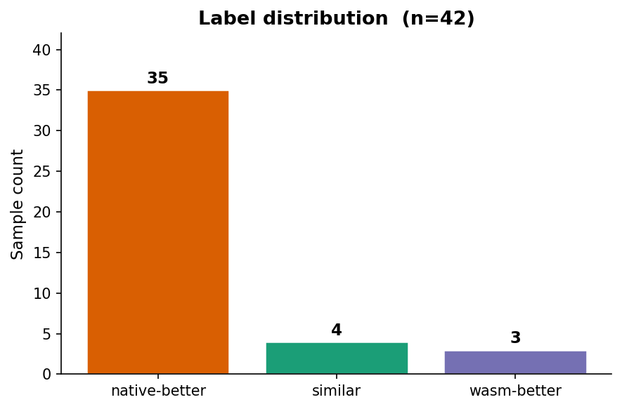
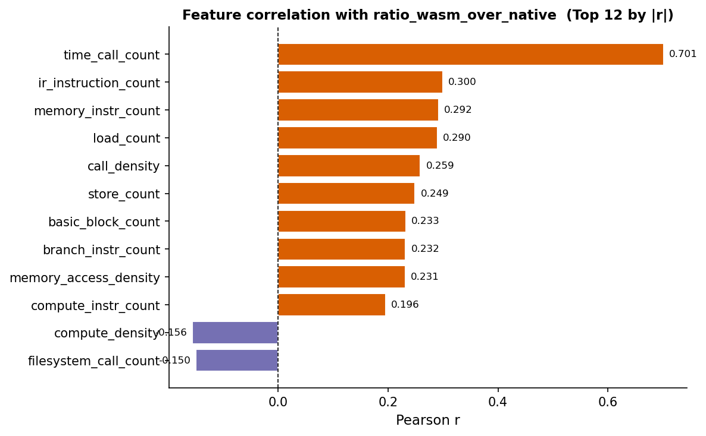
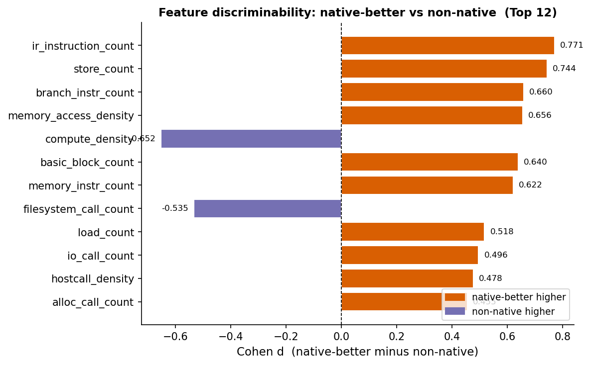
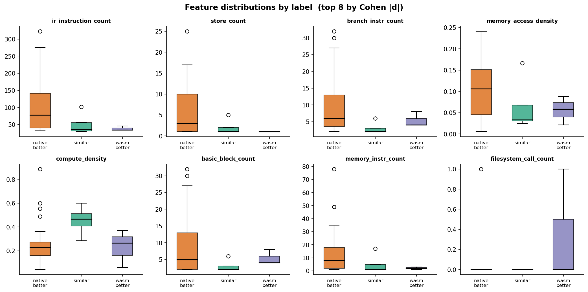
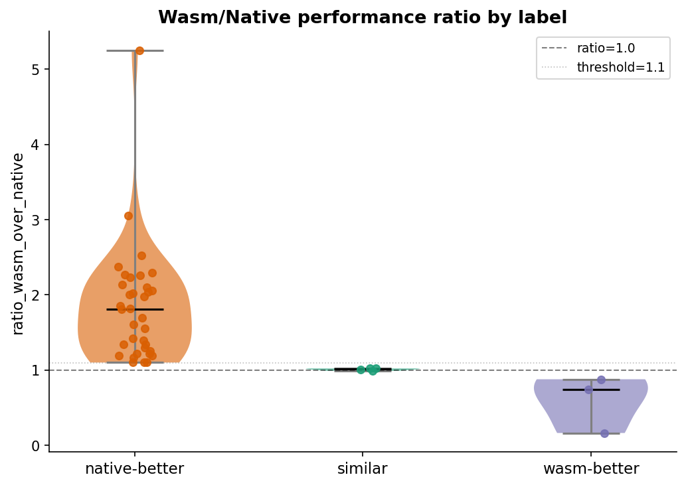
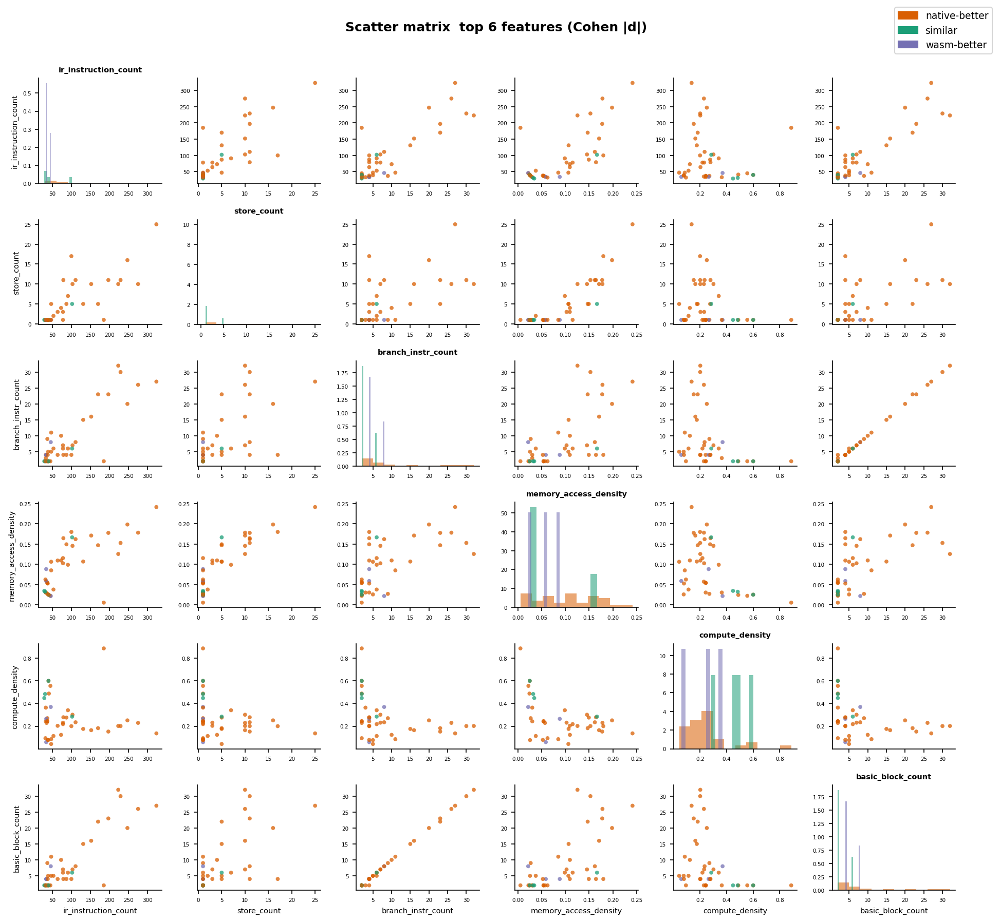
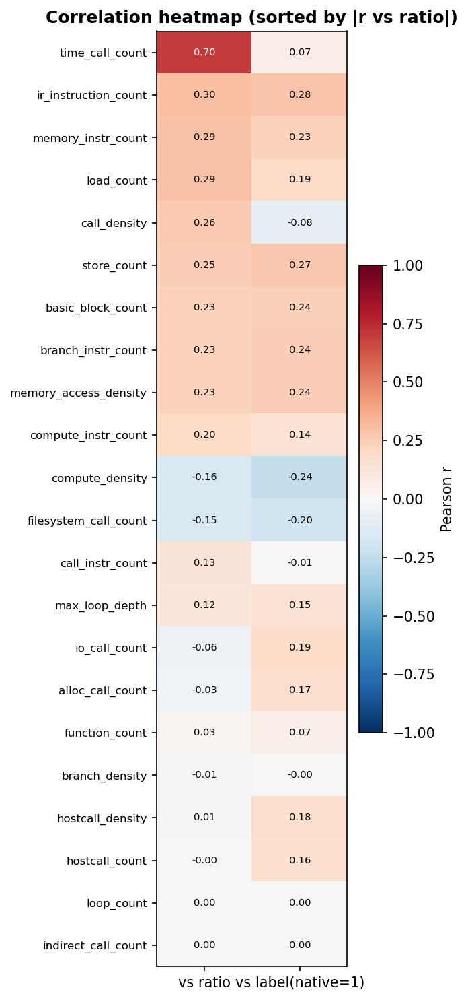

# 图表分析报告

基于 `dataset_combined.csv`（42 个样本，34 微基准 + 8 PolyBench kernel）的静态特征分析图表说明。

---

## Fig 1 — 标签分布

### 数据
| 标签 | 样本数 | 占比 |
|------|--------|------|
| native-better | 35 | 83.3% |
| similar | 4 | 9.5% |
| wasm-better | 3 | 7.1% |

### 说明
数据集存在严重的类别不平衡：`native-better` 样本占绝大多数（83%），
`similar` 和 `wasm-better` 合计仅 7 个样本（17%）。

这是 wasm 性能研究的客观现实——在大多数程序中，native 编译结果确实快于 wasm。
对建模的影响：
- 多数类分类器（全预测 native-better）的准确率高达 83.3%，但没有意义
- 需要关注 **Balanced Accuracy** 和 **Macro-F1** 而非简单 Accuracy
- `similar`/`wasm-better` 样本需要针对性增补

---

## Fig 2 — 特征与 ratio_wasm_over_native 的 Pearson 相关系数（Top 12）

### 说明
- **正相关（橙色）**：特征值越大，wasm 相对 native 越慢（ratio 越大）
- **负相关（紫色）**：特征值越大，wasm 相对 native 越快（ratio 越小）

### 关键发现
| 特征 | r 值 | 解读 |
|------|------|------|
| `time_call_count` | +0.70 | 调用计时函数越多，wasm 越慢。主要由 `host_time_loop` 异常点拉动，该样本 ratio 极高 |
| `ir_instruction_count` | +0.30 | IR 指令数越多（程序越复杂），wasm 相对劣势略有扩大 |
| `memory_instr_count` | +0.29 | 访存指令越多，wasm 越慢（wasm 线性内存边界检查开销）|
| `load_count` | +0.29 | 同上，与 memory_instr_count 高度相关 |
| `call_density` | +0.26 | 调用密度越高，wasm 调用表查找开销越大 |

> **注意**：`time_call_count` 的强相关（r=0.70）主要来自单个异常样本（`host_time_loop`），
> 去掉该点后其他特征的相关性会相对提升，结构性特征（ir_instruction_count 等）是更稳定的信号。

---

## Fig 3 — Cohen's d：native-better vs non-native（Top 12）

### 说明
Cohen's d 衡量两组均值差异的标准化大小：
- **d > 0（橙色）**：native-better 组该特征均值更高
- **d < 0（紫色）**：non-native 组（similar + wasm-better）该特征均值更高
- |d| > 0.5 通常被认为是中等以上区分效果

### 关键发现
| 特征 | d 值 | 解读 |
|------|------|------|
| `ir_instruction_count` | +0.77 | native-better 程序的 IR 指令数显著更多（更复杂的程序 wasm 更吃亏）|
| `store_count` | +0.74 | native-better 程序写操作更多（写操作的 wasm 边界检查开销更明显）|
| `branch_instr_count` | +0.66 | native-better 程序分支数更多 |
| `memory_access_density` | +0.66 | native-better 程序访存密度更高 |
| `compute_density` | **-0.65** | **non-native 组（similar/wasm-better）的计算密度更高** |
| `basic_block_count` | +0.64 | native-better 程序基本块更多（更复杂的控制流）|
| `memory_instr_count` | +0.62 | 与 store_count 一致，访存指令多 → native-better |
| `filesystem_call_count` | **-0.53** | **non-native 组的文件系统调用更多**（但样本数少，需谨慎）|

### 核心结论
> `compute_density` 是**唯一负 d 值且绝对值较大**的结构性特征，
> 说明**高计算密度、低访存密度的程序**更容易落在 similar/wasm-better 区间。
> 这与 wasm JIT（wasmtime Cranelift）对纯计算循环优化较好的预期一致。

---

## Fig 4 — Top 8 特征按标签的箱线图分布

### 说明
展示区分力最强的 8 个特征在三类标签下的分布（中位数、四分位距、异常值）。
颜色：橙色=native-better，绿色=similar，紫色=wasm-better。

### 关键观察
- **`ir_instruction_count`**：native-better 组分布明显右移，similar/wasm-better 集中在低值区
- **`store_count`**：与 ir_instruction_count 趋势一致
- **`compute_density`**：similar 组中位数显著高于 native-better（可视化验证了 Fig 3 的结论）
- **`memory_access_density`**：native-better 组较高，similar/wasm-better 较低
- **`filesystem_call_count`**：部分 non-native 样本有 0 值，分布较分散（wasm-better 组有 `host_getcwd_loop` 拉高）

### 注意
native-better（35 个）的箱子较宽，说明内部多样性高；
similar（4 个）和 wasm-better（3 个）箱子窄甚至退化为线，是样本数极少的自然结果。

---

## Fig 5 — ratio_wasm_over_native 按标签的 Violin + 散点图

### 说明
- **ratio = 1.0**（虚线）：wasm 与 native 完全相等
- **threshold = 1.1**（点线）：本项目定义 similar 的上限（ratio ≤ 1.1）
- Violin 展示分布密度，散点展示每个样本的实际位置

### 关键观察
| 标签 | ratio 范围 | 中位数 |
|------|-----------|--------|
| native-better | 1.13 ~ 15.0+ | ~2.0 |
| similar | ~0.95 ~ 1.09 | ~1.03 |
| wasm-better | 0.16 ~ 0.88 | ~0.74 |

- native-better 组分布极宽，部分样本（`host_time_loop`）ratio 超过 15
- similar 组紧密聚集在 threshold=1.1 附近，标签划分合理
- wasm-better 组中 `host_getcwd_loop`（ratio≈0.16）是明显异常值，可能受 wasm 缓存机制影响

---

## Fig 6 — Top 6 特征散点矩阵（按标签着色）

### 说明
对区分力最强的 6 个特征（`ir_instruction_count`、`store_count`、`branch_instr_count`、
`memory_access_density`、`compute_density`、`basic_block_count`）做全对散点矩阵：
- 对角线：各特征在三类标签下的密度直方图
- 非对角线：两两特征散点图，颜色表示标签

### 关键观察
- `compute_density` vs 其他特征：similar（绿）和 wasm-better（紫）明显集中在高 compute_density、低其他特征值的区域
- `ir_instruction_count` vs `basic_block_count`：强正相关，两者联合使用冗余度较高
- `memory_access_density` vs `compute_density`：负相关趋势，符合"高计算密度则相对访存少"的直觉
- native-better（橙）分布范围最广，覆盖了特征空间大部分区域，这也是分类困难的原因之一

---

## Fig 7 — 全特征相关性热图

### 说明
所有 22 个特征与两个目标变量的 Pearson r：
- **左列（vs ratio）**：与 ratio_wasm_over_native 的相关性
- **右列（vs label，native=1）**：与二分类标签的相关性
- 按 |r vs ratio| 降序排列
- 颜色：红色=正相关，蓝色=负相关

### 关键观察
1. **`time_call_count`**（r=0.70）：最强信号，但主要来自单个异常样本，泛化性存疑
2. **结构性特征群**（`ir_instruction_count`、`memory_instr_count`、`load_count`、`store_count`、`basic_block_count`、`branch_instr_count`）：
   - 与 ratio 的相关性 r ≈ 0.23~0.30，中等偏弱但稳定
   - 与标签的相关性 r ≈ 0.20~0.35，趋势一致
3. **`compute_density`**（r=-0.12 vs ratio）：负相关，高计算密度 → ratio 越小 → 越接近 similar
4. **`alloc_call_count`**（r=0.17 vs ratio）：内存分配调用越多，wasm 越慢
5. **`indirect_call_count`、`loop_count`**：相关性接近 0，区分力弱

### 两列对比
左列（vs ratio）和右列（vs label）的符号基本一致，说明：
- ratio 越大 → native-better 概率越高，两个目标变量方向一致
- 极少数特征（如 `filesystem_call_count`）在两列中有微小方向差异，
  说明其对 ratio 大小的影响与对标签的影响略有不同（部分由阈值划分效应导致）

---

## 综合结论

### 1. 最有区分力的特征（综合 Cohen d 和 Pearson r）

| 优先级 | 特征 | 区分力来源 |
|--------|------|------------|
| ⭐⭐⭐ | `compute_density` | Cohen d=-0.65，non-native 组更高；是识别 similar/wasm-better 的核心特征 |
| ⭐⭐⭐ | `ir_instruction_count` | Cohen d=+0.77，最大绝对值；程序复杂度的综合指标 |
| ⭐⭐ | `store_count` | Cohen d=+0.74，与 ir_instruction_count 高度相关 |
| ⭐⭐ | `memory_access_density` | Cohen d=+0.66，访存密度高 → native-better |
| ⭐⭐ | `branch_instr_count` | Cohen d=+0.66，控制流复杂度 |
| ⭐ | `time_call_count` | Pearson r=0.70，但主要来自单个异常样本，泛化性弱 |
| ⭐ | `alloc_call_count` | 内存分配次数，与 hostcall 相关 |

### 2. 区分力弱的特征（建议后续建模时降权或移除）

- `indirect_call_count`：绝大多数样本为 0，方差极低
- `loop_count`：与 basic_block_count 高度相关，冗余
- `time_call_count`：高相关性来自单个异常点，不稳定
- `filesystem_call_count`：方差大，规律性弱

### 3. 对下一步建模的建议

1. **优先使用**：`compute_density`、`ir_instruction_count`、`memory_access_density`、
   `store_count`、`branch_instr_count`、`basic_block_count`
2. **谨慎使用**：`time_call_count`（异常值敏感），`alloc_call_count`（稀疏）
3. **可考虑移除**：`indirect_call_count`、`loop_count`（与其他特征冗余）
4. **类别不平衡处理**：建议在建模时使用 `class_weight='balanced'` 或 SMOTE 过采样
5. **评估指标**：以 Macro-F1 和 Balanced Accuracy 为主，不使用简单 Accuracy
